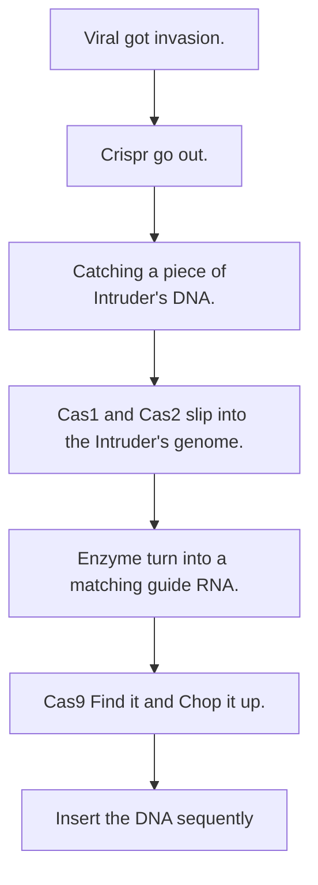
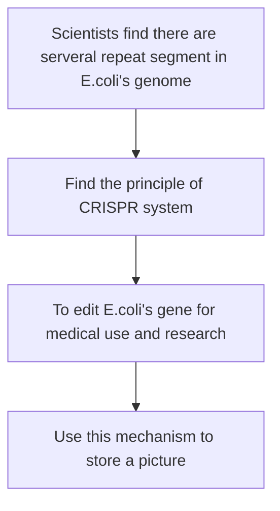
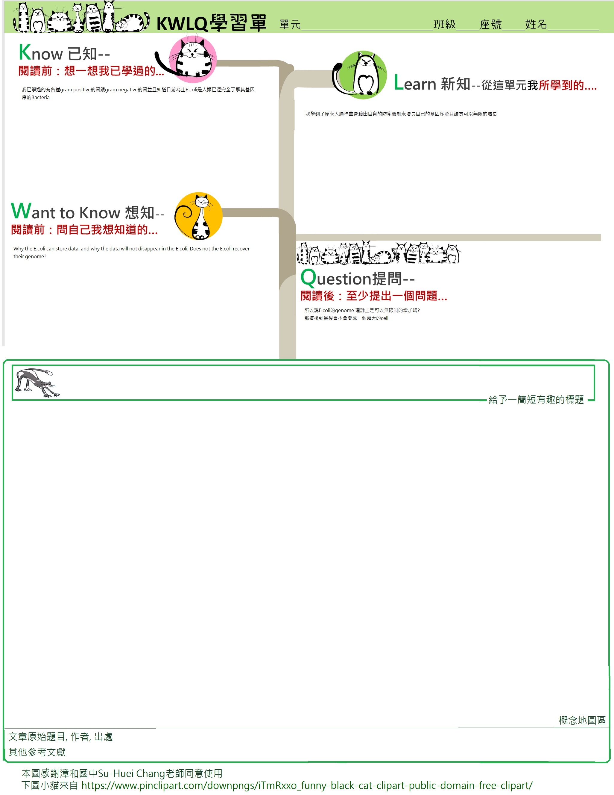

<link rel="stylesheet" href="./index.css">

# E.colid-State Drive
## NOTE
>All the content is writed by Markdwon you can see the source in my <a href="https://github.com/karta2341940/bionology/tree/main/HW2">Github</a> there store my class notes but not all.

#### Table of Content
 - [Introduction](#introduction)
    - [Motivation](#the-motivation-to-study-this-topic)
    - [About E.coli](#ecoli)
    - [DNA](#dna)
 - [Storage](#storage)
 - [Crispr](#crispr)
 - [Principle](#principle)
 - [Application](#appliction)
 - [Concept map](#concept-map)
 - [study sheet](#study-sheet)
 - [Article Source](#article-source)
 - [Reference](#reference)

# Introduction
## The Motivation to Study this topic
At first I have to explan why choose this topic.
In the last assignment the assistant who comment my homework said "	
可挑選有點難度的文章" in the field "文章深度適切".It piss me off when I saw it. And that assignment take me five nights from 8pm to 2am to understand the article and to finish the assignment.So this time I pick this topic maybe it's more difficult than last time.
## E.coli
*E.coli ( Escherichia coli )* is the commonest microbe in animal's body. 
Besides made human get stomachache, E.coli also bring some contribution for human due to their *genome is easy to edit .*
## DNA
DNA has been described as the most ultimate infomation storage.It can use four bases ACTG to store large of information.And also it is the _lightest_ way to store infomation. 
The size of human's DNA is 3.2Gbp, lets convert it into computer unit.

The base unit of DNA is *base pair ( bp )* and it is combined by 2 *nucleobases.*
Computer's base unit is bit but we usually use byte(8bit) as a base storage unit.
There are 2 base in a base pair so we can know 4 bp is equivalent to 1 byte. 

$3.2Gbp = 3.2\times10^9bp = 3.2\div4\times 10^9bp =(0.8\times10^9)bytes=(8\times 10^8)bytes$
$Convert\; to \; MB \Rightarrow 8\times 10^8bytes = ( \frac{8\times 10^8}{1024^2}) bytes \Rightarrow 762.939453125MB$

As we can see a human we need 763 MB to store in computer. what's that means?

It means we need the area equivalent to a 1Gb NAND chip (the area of NAND chip we use now is close to $3cm^2$ ) to store a humanrace's DNA.

#### Keywords:

- E.coli ( Escherichia coli )
- genome is easy to edit
- base pair ( bp )
- nucleobases

#### Key Point:
> DNA is a more smaller and lighter information container.
If we want to store a human's genome, we can use chip but it take larger place then DNA

# Storage
Scientists have already used plain old DNA to encode and store all 587287 words of _War and Peace_,a list of all the plant material archived in the Svalbard Seed Vault, and an OK Go music video.

But now scientists created a living library,embedded whitin,you guessed it: E.coli.

Harvard researchers describe using *Crispr system* to insert bits of DNA encoded with photos and GIF of a galloping horse into live bacteria.And they have retrieved and reconstructed the images by sequencing the bacterial genomes,the images got about 90 percent accuracy
#### Keywords:

Crispr System

#### Key Point:
>Scientists have store digital data into E.coli's DNA and also retrived,
reconstructed successful by Crispr.

# Crispr
CRISPR ( **C**lustered **R**egularly **I**nterspaced **S**hort **P**alindromic **R**epeats ) makes all shorts of wild things possible and people are rightfully excited about it. As a very short prime, CRISPR-associated proteins(in this instance, specifically proteins known as Cas1 and Cas2) act as a DNA version of a computer's Ctrl+X tool, allowing scientists to select specific segments of DNA, cut them out, fiddle with the, and even replace them altogether.

#### Key words:

- Cas1
- Cas2

#### Key Point:

>Crispr is a technique to edit DNA, it can paste or cut out a segment of gene and made the genome turn into the shape scientists want.
So here we can use this technique to write, read a data from DNA.Also thie technique is wildly using in medical field.

# Principle 
In this case maybe you are confuse what is Crispr-Cas1 and Cas2? And what's the difference between Crispr-Cas9 and Cas1, Cas2?

Crispr-Cas9 is the protein that does all the cutting,i.e. gene editing's heavy lifting.
Lesser known are Cas1 and Cas2. They are the ones that tell Cas9 where to do the cutting.

The whole process that Crispr works is when enemy injecting its DNA into an E.coli's cell, The Crispr in E.coli will go out and try to catch the enemy's DNA, Also the Cas1 and Cas2 will slip into the enemy's genome to marking the segment, the enzyme will turn the genome segment into a matching guide RNA, then Cas9 will find it and chop it up.

Finally the genome will be inserted into the E.coli's genome in a specific space. And the sequence is not sorted by random, It's sorted by the time that the enemy's DNA invasion.

If we watch a bacteria's DNA, we'll find the history that this bacteria's defense. If above is too hard to understand you can see the chart following.

#### key words
- Crispr-Cas9

#### key point
> This chapter is talking about how the Crispr system works. And we can know about that the system is a bacteria's defense system. So we use the mechanism to insert the data what we want to store.

# Appliction
This technology is not for store digital data mainly, though this is a bonus. This technology is not only for scaling down our computer hard drive to a bacterial size, but also to store our gene information on a bacteria, through its machanism to record any animal's cell, made it into a biological information recoder.

#### key words
- Biological information recoder
#### key point
> Through the CRISPR system we can made bacteria into a biological information recorder.It made us use less space to store more information. And it's more safe than our drive because bacteria copy itself just use a few minutes but drive maybe need many hours, and we can freeze a bateria that its DNA will save for several years, but hard drive not, if you cut out power for serveral years maybe the data will disappearing and you never gonna made it back.

# Concept map
## History

## Principle :

# Study sheet

# Article Source
[Scientists have inserted a GIF of a horse into living bacteria — did your brain just explode?](https://techcrunch.com/2017/07/12/harvard-nature-crispr-cas1-cas2-horse-gif/)

[Gif and image written into the DNA of bacteria](https://www.bbc.com/news/science-environment-40585299)

[Scientists Upload a Galloping Horse GIF Into Bacteria With Crispr](https://www.wired.com/story/scientists-upload-a-galloping-horse-gif-into-bacteria-with-crispr/)

# Reference
* [基因組學－人類基因體計劃及其應用](https://www2.nsysu.edu.tw/Bio/images/commen/Genomics-Human%20genome1090530.pdf)
* [Base pair](https://en.wikipedia.org/wiki/Base_pair)
* [Cas1](https://en.wikipedia.org/wiki/Cas1)
* [Cas2](https://en.wikipedia.org/wiki/Cas2)
* [Introduction to the CRISPR/Cas9 system](https://www.takarabio.com/learning-centers/gene-function/gene-editing/gene-editing-tools-and-information/introduction-to-the-crispr/cas9-system)