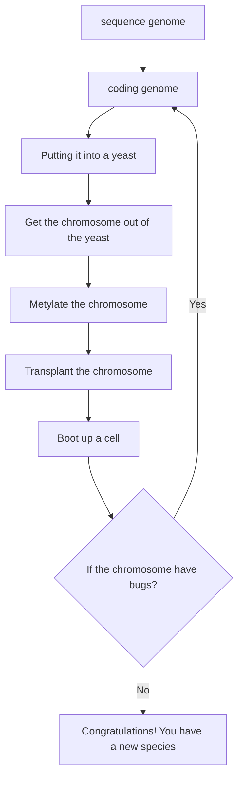

<h1>Synthia</h1>

- [Introduction](#introduction)
- [What](#what)
- [Why](#why)
- [When](#when)
- [Where](#where)
- [Who](#who)
- [How](#how)
- [Conclusion](#conclusion)
- [Concept Map](#concept-map)
- [Reference](#reference)

# Introduction
Synthia is a word that meaning something is made by human beings. But here is not only meaning a production that human made but also a life that can **reproduce itself**.
In nowadays **E.Coli** and **Mycoplasma** can be created by human beings. But the first is Mycoplasma. The first human-made mycoplasma is made by the **digital code in the computer** and it built in a chromosome from four bottle of chemicals. Assmbly that **chromosome** in **yeast** and transplating it into a recipient bacteria cell and transforming that cell into a new bacteria species.
This is the first self-replicating species whoes parent is a computer. It also is the first species that have its own website encoded in its genetic code

# What
What is Synthia? Synthia is a **chemically synthesized genome** of a mycoplasma cell based entirely on synthetic DNA which can self replicate has been referred to as mycoplasma laboratorium.

# Why
Why human build this bacterium? According to the bacterium's father, Venter, said this synthetic bacteria are a step towards creating organisms to **manufacture hydrogen and biofuels** and also to **abosorb carbon dioxide** and greenhouse gases.

# When
When our human build? Synthia is build in May 21, 2010. Before this day, the team has try over and over again from 1995, the team was in institute TIGR, they was involved squencing the first two genomes in history. They think it's could there be even a smaller genome? Could we understand the basis of cellular life at the genetic level? Then the quest have been 15 years. In 2010 they answer the question.

# Where
Where the synthia can be used? In nowadays, where it can be used we can't know. But the creator - Venter hope that it can be used to **manufacture hydrogen and biofuels** and also to **abosorb carbon dioxide** and greenhouse gases.
We can hope that someday this wishes can be realized.

# Who
Who is the creator of Synthia? The creator of Synthia is **J. Craig Venter**. He is a American biologist, entrepreneur, and geneticist. He is the founder of the Institute for Genomic Research and the founder and CEO of Synthetic Genomics, Inc. He is also the founder of Human Longevity, Inc. and the J. Craig Venter Institute. He is also the founder of the Human Genome Project.

# How
How to create synthia? 
To build a Synthia you first to do is **sequencing** the genome,
Then **coding the genome**. So here is a problem, how to check the genome can be a life or a species? The answer is **transplanting** the genome into others bacteria.
The team, create the first synthetic life in 2010, putting the **fragments** in **yeast** and yeast would **assemble** these for us.

And then we have the other problem, our bacteria chromosomes are growing in yeast. so how to get the chromosome out of the yeast? So in addition to doing the transplating, they had to find out how to get a bacterial chromosome out of the **eukaryotic yeast** into a form where they could be **transplanted** it into a recipient cell. So the team developed new techniques for actually growing, cloning entire bacterial chromosomes in yeast. So they took the same **Mycoides** genome that the team member, Carole, had initially transplanted, and they grew it in yeast as an **artificial chromosome**.

So now we have the chromosomes. But it can't transplant and boot up a cell.
In order to boot up und transtplant a cell, the team find that the DNA in bacterial cell was actully methylated, and the mathylation protects it from the **restriction enzyme** from **digesting** the DNA.
Now we know if we took the chromosome out of yeast and metylated it, we could then transplant it.

If you follow the steps above, grow and transplant chromosome, you will get a new bacteria species(maybe). According to the team leader, Venter, said they was debuging the genome code error over and over again, so we can know how difficult it that to build a new species.

Above are the steps to create Synthia(simplified method).
That's all of my homework. Thank you for reading.

# Conclusion
Venter who lead a team to build a bacteria in 2010 publish a research that a new species of bacteria is created by his team. And they named it Synthia. Synthia is a chemically synthesized genome of a mycoplasma cell based entirely on synthetic DNA which can self replicate has been referred to as mycoplasma laboratorium.
# Concept Map
How to create Synthia

# Reference 
1. [Mycoplasma](https://en.wikipedia.org/wiki/Mycoplasma)
2. [Mycoplasma laboratorium](https://en.wikipedia.org/wiki/Mycoplasma_laboratorium)
3. [Scientists Created Bacteria With a Synthetic Genome. Is This Artificial Life?](https://www.nytimes.com/2019/05/15/science/synthetic-genome-bacteria.html)
4. [Scientists Create E. Coli Bacteria With Completely Synthetic Genome](https://www.smithsonianmag.com/smart-news/scientists-create-e-coli-bacteria-completely-synthetic-genome-180972214/)
5. [Mycoplasma pneumoniae - Microbiology](https://www.youtube.com/watch?v=vP1IZ8lXqh4)
6. [Mycoplasma Laboratorium](https://www.youtube.com/watch?v=w9376FcvC-c)
7. [Craig Venter unveils "synthetic life"](https://www.youtube.com/watch?v=QHIocNOHd7A)
8. [Scientists Create Synthetic Organism](https://www.wsj.com/articles/SB10001424052748703559004575256470152341984)
9. [Mycoplasma laboratorium](https://resources.saylor.org/wwwresources/archived/site/wp-content/uploads/2011/06/Mycoplasma-laboratorium.pdf)
10. [SYNTHIA: PLAYING GOD IN A SANDBOX](https://microbiologysociety.org/publication/past-issues/what-is-life/article/synthia-playing-god-in-a-sandbox-what-is-life.html)
11. [J. Craig Venter](https://www.jcvi.org/about/j-craig-venter)
12. [Craig Venter](https://en.wikipedia.org/wiki/Craig_Venter)
<link rel="stylesheet" href="./index.css">
